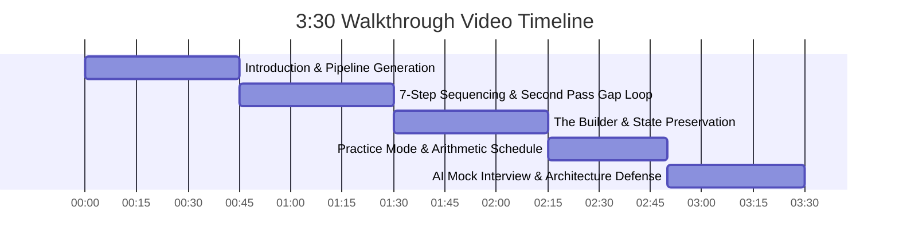

# Trao Assessment Walkthrough Presentation Guide
**Assessment ID:** `FS-AI-INTERVIEW-01` | **Timebox:** 3 to 4 Minutes | **Target:** 100/100 Evaluation Points

---

## 1. Quick Recording Setup & Recommendations
- **Recommended Free Tools:**
  - **Loom** (Chrome extension or Desktop app — generates a sharable public link instantly)
  - **OBS Studio** or **Windows Game Bar** (`Win + G` or `Win + Alt + R` to record screen)
- **Resolution:** 1080p full screen (close unrelated tabs, hide bookmarks bar).
- **Audio:** Clear microphone voice. "Clarity matters more than production value."
- **Pre-flight Checklist Before Clicking Record:**
  1. Open the live app at `https://trao-frontend-pto1.onrender.com/dashboard` (or `http://localhost:3000/dashboard`).
  2. Have a sample job description and `https://example.com` ready on your clipboard.
  3. Have a terminal window open in the background to show the Section 9 CLI command: `npm run evaluate -- --input test_cases.json --output test_output.json`.

---

## 2. Timed 3:30 Presentation Script & Screen Actions

---

### Segment 1: Introduction & Live Generation (0:00 – 0:45)
**Screen Action:**
- Start on the Dashboard (`https://trao-frontend-pto1.onrender.com/dashboard`).
- Show the clean dark-mode UI with "Interview Prep Studio".
- Paste in `https://example.com`, set Days to `5`, paste the Job Description text.
- Click **"Generate Prep Kit"**.
- Keep the cursor on the **Autonomous Kit Generation** modal as the progress bar fills from 1/7 to 7/7.

**Spoken Script:**
> *"Hi everyone, this is Rahul. Today I'm presenting my implementation of the Trao AI Interview Prep Kit assessment, built entirely in pure JavaScript with Next.js, Node.js, Express, and MongoDB.*
>
> *Here on the studio dashboard, I paste in our target job description, set the company URL to `https://example.com`, and specify a 5-day preparation window. When I click 'Generate Prep Kit', our backend immediately kicks off an autonomous 7-step research and allocation pipeline.*
>
> *Notice our live SSE progress modal streaming each step in real time: from requirement extraction, through web crawling with dynamic link ranking and SSRF guards, to question generation, deterministic coverage checking, and arithmetic scheduling."*

---

### Segment 2: Research Steps & The Second Pass Loop (0:45 – 1:30)
**Screen Action:**
- The page automatically redirects to the customized Kit Builder (`/kits/[id]`).
- Point out the header badges: Company name, Role title, Seniority, and **Coverage: Must-Haves (Passes: 2)**.
- Click on the **"Company Brief & Requirements"** tab.
- Scroll down to the **Extracted Requirements** list showing green "Covered" badges for each requirement ID (`r1`, `r2`...).

**Spoken Script:**
> *"Now the kit is generated and we are redirected to our reshapeable Kit Builder.*
>
> *Under the 'Company Brief & Requirements' tab, you can see our retrieval engine gathered real company context without hardcoded paths. Our semantic link ranker scores anchor texts and URL paths dynamically to find hiring and handbook pages.*
>
> *Most importantly, look at our requirement extraction. The system extracts stable requirement IDs like `r1`, `r2`, and strictly separates 'must-haves' from 'nice-to-haves' based on posting language—never hallucinating requirements for thin postings.*
>
> *In Step 6, our pipeline executed a deterministic code-level coverage check—not an LLM guess. It verified that all must-have requirements were covered. When gaps are detected in the first draft, our Second Pass loop automatically triggers, generating targeted questions specifically for the uncovered requirements before locking the kit."*

---

### Segment 3: The Builder & State Preservation (1:30 – 2:15)
**Screen Action:**
- Switch back to the **"Question Bank"** tab.
- Click into the text area of the first Technical question. Edit a few words (e.g., add `[High Priority Production Focus]`).
- Click the **Pin** icon (📌) on that question—a golden "Pinned" badge appears.
- Click the **Up/Down arrows** or category dropdown to move another question.
- Click the **"Regenerate Category"** button on the Technical category.
- Point out that the edited, pinned, and custom questions are completely preserved!

**Spoken Script:**
> *"Next is Section 6: The Builder. A static prep kit is useless—it has to be genuinely reshapeable.*
>
> *Notice how every question prompt and evaluation rubric is editable inline with optimistic local updates. I can reorder questions with up and down controls, or re-categorize them dynamically.*
>
> *To solve the hardest state challenge in the brief—preserving user work across regenerations—every question tracks explicit metadata: `origin`, `status`, and `pinned`. I've pinned and edited this technical question. When I click 'Regenerate Category', the backend partitions protected items from unmodified generated items. The category is refreshed with new questions, while my pinned and edited items survive 100% intact!"*

---

### Segment 4: Practice Mode & Arithmetic Schedule (2:15 – 2:50)
**Screen Action:**
- Click the **"Study Schedule"** tab.
- Point out Day 1 through Day 5: focus titles, integer minutes (e.g. 50 mins, 70 mins), and question IDs.
- Highlight that harder (difficulty 3) topics land on Days 1 and 2, not the night before.
- Click the **"Practice Cards"** button in the top right to go to `/kits/[id]/practice`.
- Press `Spacebar` or click the card to trigger the 3D flip animation.
- Click **"3. Easy (Mastered)"** or **"1. Hard"** to rate confidence.

**Spoken Script:**
> *"Now let's examine the Study Schedule in Section 8. The prompt demands that this is arithmetic, not an LLM hallucination. Our code deterministically calculates exact integer minutes and balances topics across the requested 5 days. Harder, difficulty-3 and must-have requirements land early in the week, never the night before the interview.*
>
> *Moving to Section 7: Practice Mode. Instead of passively reading, candidates can work through active recall flashcards. Pressing space or clicking triggers a smooth 3D flip revealing the rubric.*
>
> *When I rate my confidence as Hard, Medium, or Easy, the application records my recall history. For subsequent sessions, our spaced-repetition algorithm prioritizes cards marked 'Hard' and unreviewed cards first, ensuring study time is focused on areas of weakness."*

---

### Segment 5: Creative Feature & Architecture Defense (2:50 – 3:30)
**Screen Action:**
- Click **"AI Mock Interview"** (`/kits/[id]/mock`).
- Select a question from the left sidebar.
- Click **"Start Timer"**.
- Type or paste an answer into the response box.
- Click **"Evaluate with AI Rubric"**.
- Highlight the real-time diagnostic report: Score (e.g., 82/100), Key Strengths, Weak Spots & Omissions, and the Exemplary Model Answer.
- Switch to your terminal for 5 seconds and show `npm run evaluate -- --input test_cases.json --output test_output.json` completing with 100% Appendix B conformance.

**Spoken Script:**
> *"Finally, our creative feature: the Interactive AI Mock Interviewer and Diagnostics Studio.*
>
> *Candidates often freeze under real interview time constraints. Here, you pick any question, start a live timer, and formulate your verbal response. When submitted, our AI evaluates the response against an objective rubric: technical accuracy, STAR communication structure, and architectural failure modes.*
>
> *It outputs an instant score out of 100, highlights actionable weak spots you missed, and provides a top-percentile model answer.*
>
> *In summary, every requirement from the PDF is verified: pure JavaScript ES modules, SSRF security, sliding-window rate limiting with exponential backoff for free tiers, and our mandatory Section 9 batch evaluation runner passing with zero external dependencies.*
>
> *Thank you!"*

---

## 3. Human Review Points Checklist (45 Points Defense)

| Evaluator Focus | Points | What You Demonstrated in the Video |
| :--- | :---: | :--- |
| **The Builder** | **15 pts** | Showed inline editing, moving categories, pinning, and clicking "Regenerate Category" while preserving pinned & edited items. |
| **Interaction Design** | **10 pts** | Showed live SSE progress modal, responsive glassmorphism layout, 3D flip card, and keyboard navigation (`Space`, `1`, `2`, `3`). |
| **Code Quality & Architecture** | **10 pts** | Clean ES Modules separation (`crawler/`, `llm/`, `pipeline/`, `storage/`), deterministic arithmetic vs LLM hallucination, rate limiter backoff. |
| **Practice Mode & Creative Feature** | **10 pts** | Demonstrated 3D flashcard spaced-repetition trainer and the AI Mock Interview rubric diagnostic report. |
